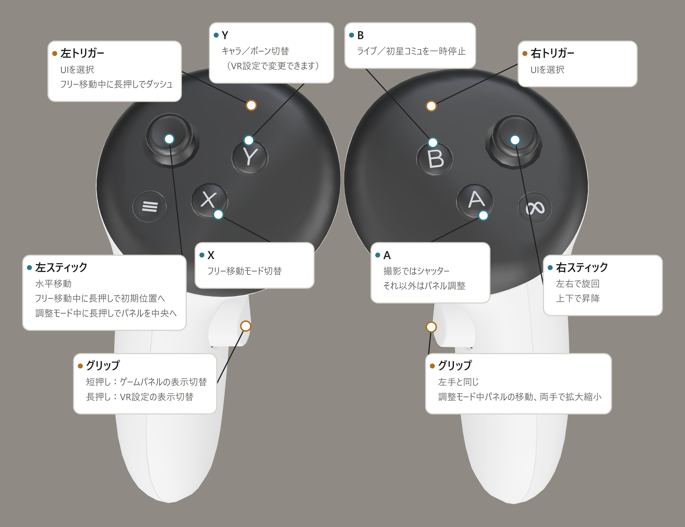

[English](README.md) | [简体中文](README.zh-CN.md) | [繁體中文](README.zh-TW.md) | **日本語**

# gakumas-VRify

『学園アイドルマスター』に VR 対応を追加する非公式 Mod です。**DMM 版のみに対応しています。** [gkms-localify-dmm](https://git.chinosk6.cn/chinosk/gkms-localify-dmm) をベースに開発しています。

## ご利用前に

- ゲーム自体は VR 向けに設計されていません。キャラクターが表示されない、位置がずれる、画面がちらつくなどの問題が発生する場合があります。
- **VR 酔いや画面の点滅にご注意ください。体調に異変を感じた場合は、直ちに使用を中止してください。**
- 本プロジェクトによる変更はローカル環境に限られますが、ゲームの改変に当たります。[利用規約](https://legal.bandainamcoent.co.jp/terms/nejp)などの関連規則をご確認のうえ、利用するかどうかをご判断ください。**アカウントおよび利用に伴う結果は、ご自身の責任となります。**
- 本プロジェクトはファンによる非公式プロジェクトです。ベースとなったプロジェクトおよびゲームの権利者とは利害関係がなく、それらの立場を代表するものでもありません。

## インストールと起動

1. Windows x64 の DMM 版ゲームを用意します。
2. [Releases](https://github.com/KagaminTheMirror/gakumas-VRify/releases) から最新の配布パッケージをダウンロードします。
3. ゲームを終了し、`gakumas.exe` があるゲームフォルダーにパッケージを展開します。更新時は、新しいパッケージを同じフォルダーに展開して上書きするだけです。
4. ヘッドセットを PC に接続し、ゲームを起動します。

現在、Quest 3 + Virtual Desktop の組み合わせでのみ動作確認を行っています。他の機器での使用感は保証できません。

## Quest コントローラーガイド

## ビルドと開発への参加

ソースからのビルド方法は [BUILDING.md](BUILDING.md)、ソースの管理範囲とLocalify の更新への対応は [UPSTREAM.md](UPSTREAM.md) を参照してください。

## ライセンスと謝辞

本プロジェクトは [GPL-3.0](LICENSE) で公開しています。サードパーティーのコンポーネントにはそれぞれのライセンスが適用されます。詳細は [THIRD_PARTY_NOTICES.md](THIRD_PARTY_NOTICES.md) を参照してください。ゲームのアセットやインストールファイルは含まれていません。
