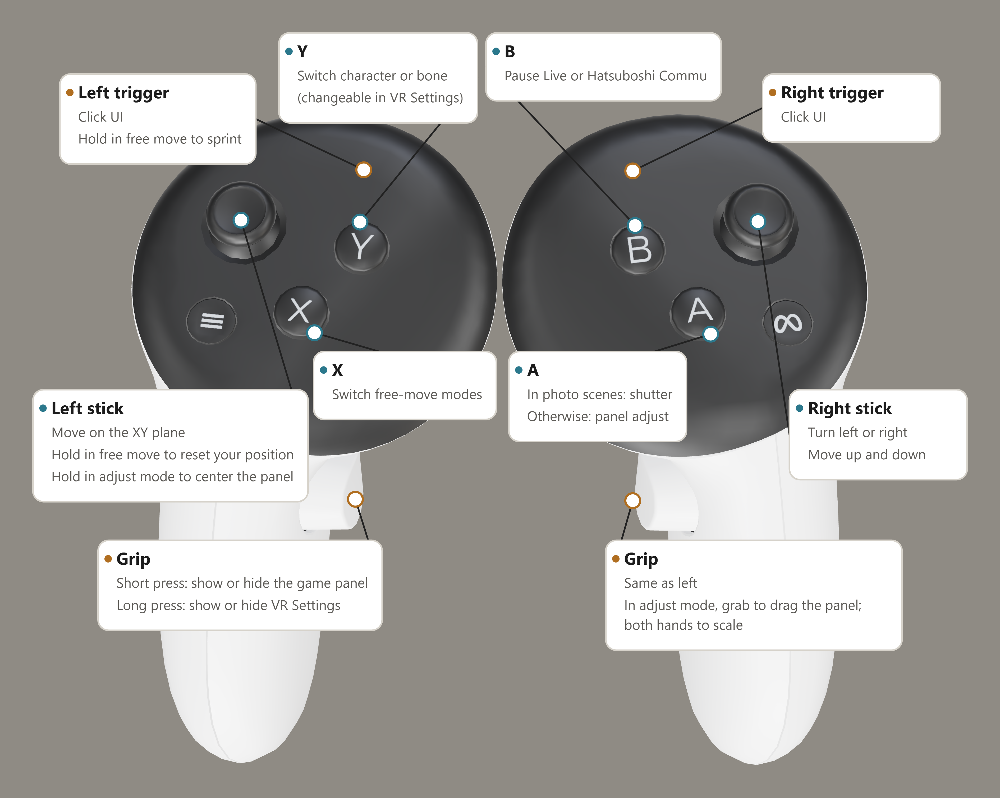

**English** | [简体中文](README.zh-CN.md) | [繁體中文](README.zh-TW.md) | [日本語](README.ja.md)

# gakumas-VRify

An unofficial VR mod for **Gakuen IDOLM@STER (学園アイドルマスター), DMM version only**, built on [gkms-localify-dmm](https://git.chinosk6.cn/chinosk/gkms-localify-dmm).

## Before you play

- The game was not designed for VR. Characters may disappear or appear in the wrong place, and the image may flicker.
- **VR motion and flashing images can cause discomfort. Stop immediately if you feel unwell.**
- This project modifies the game locally. Review the applicable rules, including the [User agreement (Japanese)](https://legal.bandainamcoent.co.jp/terms/nejp), before deciding to use it. **You are responsible for your account and your use of the mod.**
- This is a fan-made project, with no affiliation with or endorsement from the upstream project or the game's rights holders.

## Install and run

1. Use the Windows x64 DMM edition of the game.
2. Download the latest release package from [Releases](https://github.com/KagaminTheMirror/gakumas-VRify/releases).
3. Close the game. Extract the package into the game directory containing `gakumas.exe`. To upgrade, extract the new package into the same directory and overwrite.
4. Connect your headset to your PC, then launch the game.

Currently tested only with Quest 3 + Virtual Desktop. The experience on other devices is not guaranteed.

## Quest controller guide

## Building and contributing

For building from source, see [BUILDING.md](BUILDING.md). Source ownership and upstream updates are documented in [UPSTREAM.md](UPSTREAM.md).

## License and credits

The project is distributed under [GPL-3.0](LICENSE). Third-party components retain their own licenses; see [THIRD_PARTY_NOTICES.md](THIRD_PARTY_NOTICES.md). Game assets and game installations are not included.
