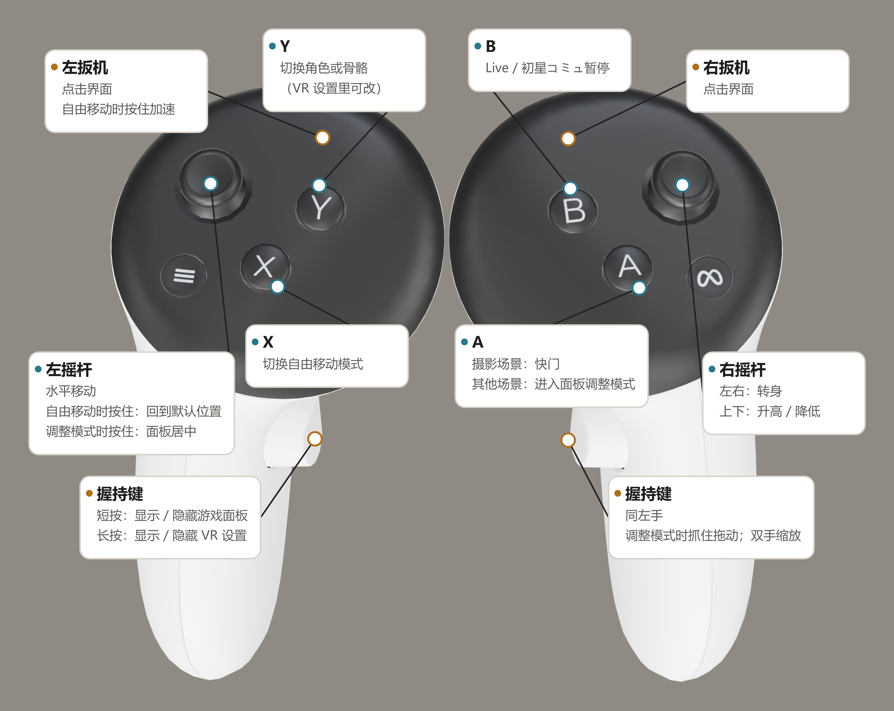

[English](README.md) | **简体中文** | [繁體中文](README.zh-TW.md) | [日本語](README.ja.md)

# gakumas-VRify

为《学园偶像大师》（学園アイドルマスター）添加 VR 支持的非官方 Mod，**仅针对 DMM 版本**。本项目基于上游 [gkms-localify-dmm](https://git.chinosk6.cn/chinosk/gkms-localify-dmm) 开发。

## 使用前请阅读

- 游戏本身并非面向 VR 开发，使用时可能出现人物缺失、位置错误、画面闪烁等情况。
- **请注意眩晕和闪烁风险。如感到不适，请立即停止使用。**
- 本项目仅进行本地修改，但依然属于对游戏的修改。使用前请自行查阅包括但不限于[用户协议（日文）](https://legal.bandainamcoent.co.jp/terms/nejp)的相关规则，再判断是否使用，并**对自己的账号及使用后果负责**。
- 本项目仅为 Fan-made Project（粉丝自制项目），与上游项目及游戏相关方均无利益关联，也不代表其立场。

## 安装与运行

1. 准备 Windows x64 的 DMM 版游戏。
2. 从 [Releases](https://github.com/KagaminTheMirror/gakumas-VRify/releases) 下载最新发布包。
3. 关闭游戏，将发布包解压到 `gakumas.exe` 所在的游戏目录。升级时同样将新版发布包解压到该目录并覆盖即可。
4. 将头显连接到电脑，然后启动游戏。

项目当前仅在 Quest 3 + Virtual Desktop 下完成测试，不能保证其它设备的使用体验。

## Quest 手柄操作指南

## 编译与贡献

从源码编译请参阅 [BUILDING.md](BUILDING.md)。源码归属与上游更新方式见 [UPSTREAM.md](UPSTREAM.md)。

## 许可与致谢

项目采用 [GPL-3.0](LICENSE) 许可。第三方组件保留各自许可，详见 [THIRD_PARTY_NOTICES.md](THIRD_PARTY_NOTICES.md)。本仓库不包含游戏资源或游戏安装文件。
