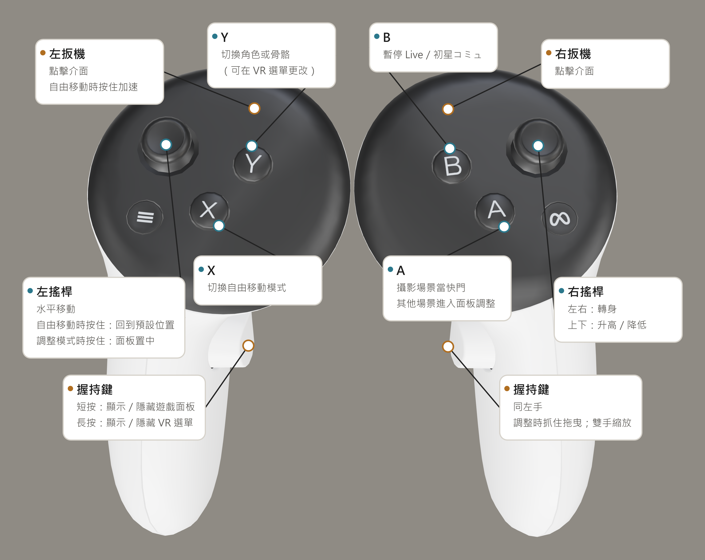

[English](README.md) | [简体中文](README.zh-CN.md) | **繁體中文** | [日本語](README.ja.md)

# gakumas-VRify

為《學園偶像大師》（学園アイドルマスター）加入 VR 支援的非官方 Mod，**僅適用於 DMM 版本**。本專案基於上游 [gkms-localify-dmm](https://git.chinosk6.cn/chinosk/gkms-localify-dmm) 開發。

## 使用前請閱讀

- 遊戲本身並非為 VR 設計，使用時可能出現角色缺失、位置錯誤、畫面閃爍等情況。
- **請注意暈眩與閃爍風險。如感到不適，請立即停止使用。**
- 本專案僅進行本機修改，但仍屬於對遊戲的修改。使用前請自行查閱包含但不限於[使用者條款（日文）](https://legal.bandainamcoent.co.jp/terms/nejp)的相關規定，再決定是否使用，並**對自己的帳號及使用後果負責**。
- 本專案僅為 Fan-made Project（粉絲自製專案），與上游專案及遊戲相關方均無利益關係，也不代表其立場。

## 安裝與執行

1. 準備 Windows x64 的 DMM 版遊戲。
2. 從 [Releases](https://github.com/KagaminTheMirror/gakumas-VRify/releases) 下載最新發布套件。
3. 關閉遊戲，將發布套件解壓縮至 `gakumas.exe` 所在的遊戲目錄。升級時同樣將新版套件解壓縮至該目錄並覆寫即可。
4. 將頭戴裝置連接到電腦，再啟動遊戲。

專案目前僅在 Quest 3 + Virtual Desktop 下完成測試，無法保證其他裝置的使用體驗。

## Quest 控制器操作指南

## 編譯與貢獻

從原始碼編譯請參閱 [BUILDING.md](BUILDING.md)。原始碼歸屬與上游更新方式請見 [UPSTREAM.md](UPSTREAM.md)。

## 授權與致謝

專案採用 [GPL-3.0](LICENSE) 授權。第三方元件保留各自授權，詳見 [THIRD_PARTY_NOTICES.md](THIRD_PARTY_NOTICES.md)。本儲存庫不包含遊戲資源或遊戲安裝檔案。
